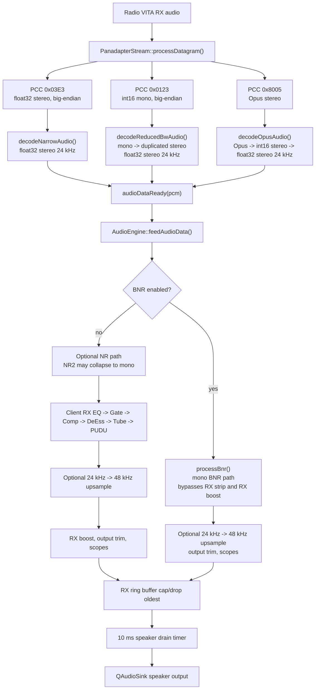
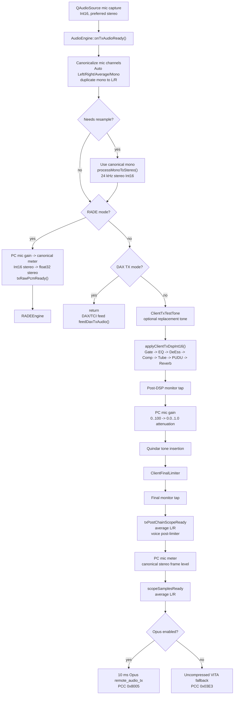
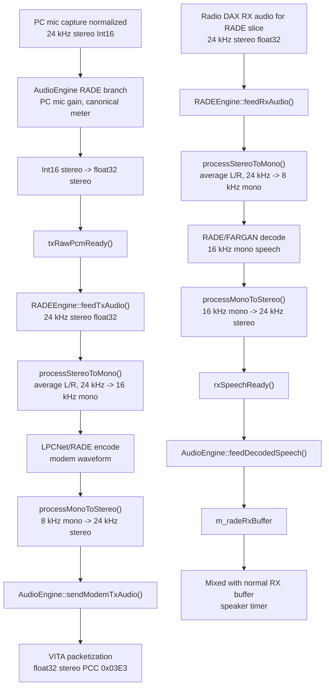
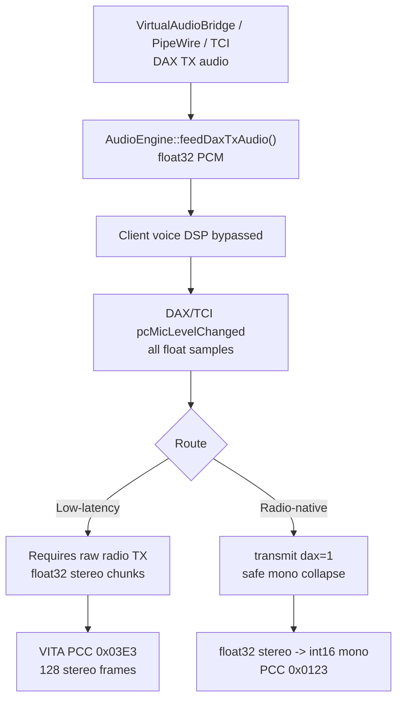

# AetherSDR Audio Pipeline

This document describes the current client-side audio paths in AetherSDR as
implemented in `src/core` and the GUI wiring. It focuses on the details a
contributor needs when changing audio code: ordering, sample formats, sample
rates, channel handling, downmixing, resampling, metering taps, gain stages, and
packetization.

## Executive summary

AetherSDR has several distinct audio paths that share some helpers but do not
all run through the same DSP chain:

- **RX speaker path**: radio audio from `PanadapterStream` is decoded to 24 kHz
  float32 stereo and handed to `AudioEngine::feedAudioData()`. RX noise
  reduction, RX client EQ/Gate/Comp/DeEss/Tube/PUDU, output trim, optional
  24 kHz to 48 kHz upsampling, metering, scopes, and speaker buffering happen
  in `AudioEngine`.
- **Local sidetone / Quindar local output**: CW sidetone and local Quindar
  monitor tones use local output sinks that are independent of the RX speaker
  buffer. They are logically tone generators, represented as stereo output
  frames.
- **PC mic voice TX path**: `QAudioSource` captures Int16 mic audio, converts it
  to the internal 24 kHz stereo frame shape, then runs the voice TX strip before
  Opus remote audio TX or an uncompressed VITA fallback.
- **Opus `remote_audio_tx` path**: the normal PC mic voice path sends 24 kHz
  stereo Int16 frames as 10 ms Opus packets over VITA-49 PCC `0x8005`.
- **RADE TX/RX path**: RADE branches early from PC mic capture and bypasses the
  Opus voice TX path. It uses float32 PCM, converts to the modem rates needed by
  LPCNet/RADE/FARGAN, and packetizes the modem waveform as VITA audio.
- **DAX TX low-latency path**: DAX/TCI float32 stereo audio bypasses client voice
  DSP and is packetized as float32 stereo VITA PCC `0x03E3`.
- **DAX TX radio-native/reduced-bandwidth path**: DAX/TCI float32 stereo audio
  bypasses client voice DSP, is averaged to Int16 mono, and is packetized as
  VITA PCC `0x0123` while the radio-side transmit `dax=1` path is active.

The internal voice and modem paths are mostly **logically mono** but are often
represented as **stereo frames** because the radio/audio interfaces expect
interleaved L/R samples. Important cases:

- PC mic voice TX is carried as stereo Int16 frames after capture normalization.
  Stereo capture is first collapsed to a canonical mono voice signal using Auto
  Left/Right/Average selection, then duplicated to L/R. If resampling is needed,
  that canonical mono signal is sent through `Resampler::processMonoToStereo()`.
- Opus `remote_audio_tx` packets are always 24 kHz stereo Int16 frames.
- RADE modem/speech processing is logically mono, but AudioEngine handoff and
  VITA packetization use 24 kHz stereo float32 frames.
- DAX radio-native TX packets are mono Int16, but the DAX bridge and TCI hand
  float32 stereo frames to `AudioEngine`.
- Reduced-bandwidth RX audio from the radio is Int16 mono and is duplicated to
  float32 stereo for the RX speaker path.

## RX speaker path

### Source and input format

`PanadapterStream::processDatagram()` decodes radio VITA packets and emits
`PanadapterStream::audioDataReady(QByteArray)` for normal speaker audio.
`MainWindow` connects that signal to `AudioEngine::feedAudioData()`.

The speaker path expects the decoded payload handed to `AudioEngine` to be
interleaved float32 stereo at 24 kHz:

- PCC `0x03E3` narrow IF/audio payloads are big-endian float32 stereo and are
  converted to native float32 stereo.
- PCC `0x0123` reduced-bandwidth payloads are big-endian Int16 mono. The decoder
  converts each sample to float32 and duplicates it to L/R.
- PCC `0x8005` Opus payloads are decoded as 24 kHz stereo Int16, then converted
  to float32 stereo.

DAX RX audio is decoded by the same `PanadapterStream` helpers but is emitted as
`daxAudioReady(channel, pcm)` rather than `audioDataReady(pcm)`.

### RX DSP ordering

`AudioEngine::feedAudioData()` is the entry point for local speaker audio. When
the radio is transmitting, the code bypasses RX noise reduction and the client
RX DSP strip and writes the received PCM to the output path directly.

When receiving, the current ordering is:

1. Radio-decoded 24 kHz float32 stereo enters `feedAudioData()`.
2. Optional RX noise reduction runs first:
   - `rn2`, `nr4`, and `dfnr` process the buffer and then re-apply RX pan.
   - `nr2` explicitly averages L/R to mono with `(L+R)/2`, processes mono, then
     duplicates mono back to stereo and re-applies RX pan.
   - macOS MNR runs through its own processor.
   - BNR averages stereo to mono, upsamples 24 kHz mono to 48 kHz mono, runs BNR,
     downsamples to 24 kHz mono, and duplicates the result to stereo. The BNR
     branch writes its own output buffer and currently bypasses the client RX
     strip and RX boost.
3. For non-BNR RX audio, `writeAudio()` runs the client RX strip in this fixed order:
   `ClientEqRx`, `ClientGateRx`, `ClientCompRx`, `ClientDeEssRx`,
   `ClientTubeRx`, `ClientPuduRx`.
4. The RX EQ analyzer tap is taken after RX EQ and before the remaining RX strip.
   It averages L/R to mono for the analyzer buffer.
5. If the selected output sink is running at 48 kHz, `AudioEngine::resampleStereo()`
   upsamples 24 kHz stereo to 48 kHz stereo. The BNR branch performs this step
   inside `processBnr()`.
6. Optional RX boost applies `tanh(2*x)` to every sample on the non-BNR path.
7. RX output trim applies a dB gain multiplier to every sample. BNR applies
   output trim but not RX boost.
8. `rxPostChainScopeReady` is emitted from the post-chain stereo signal after
   averaging L/R to mono.
9. Audio is appended to `m_rxBuffer`; a 10 ms timer drains the buffer to the
   selected speaker sink.

`AudioEngine::applyClientRxDspFloat32()` currently exists as a dispatcher stub,
but the live RX speaker strip is the explicit order inside `writeAudio()`.

### Pan handling and mono collapses

Most radio speaker audio enters as stereo. Some RX processors are mono
internally:

- `processNr2()` averages L/R to mono and duplicates mono back to stereo.
- `processBnr()` averages L/R to mono, runs the BNR path at mono rates, and
  duplicates mono back to stereo.
- The RN2/NR4/DFNR path comments note that those processors can lose radio pan;
  `applyRxPanInPlace()` is called after them to restore the client RX pan.

Radio pan is preserved through the normal non-NR RX strip and through the RX
upsampler described below.

### 24 kHz to 48 kHz upsampling

The RX output sink is 24 kHz float32 stereo when the device supports it. On macOS
and Windows, `AudioEngine::startRxStream()` prefers a 48 kHz sink when that is
the reliable device format. In that case the RX speaker path upsamples the 24 kHz
stereo stream to 48 kHz before writing to `QAudioSink`.

`AudioEngine::resampleStereo()` intentionally uses two independent `Resampler`
instances: one for L and one for R. It does **not** call
`Resampler::processStereoToStereo()`, because that helper averages L/R to mono
and duplicates the mono result back to stereo. Using separate L/R resamplers
preserves radio pan and any true stereo content.

RADE decoded speech mixed into the speaker buffer is also resampled when the
speaker sink runs at 48 kHz. That path uses `Resampler::processStereoToStereo()`;
RADE decoded speech is logically mono duplicated to stereo before that point.

### Volume, mute, boost, trim, buffer cap, and timing

- `AudioEngine::setRxVolume()` maps the UI volume to `QAudioSink::setVolume()`
  in the range `0.0..1.0`.
- `AudioEngine::setMuted()` sets the sink volume to `0.0` while muted and
  restores `m_rxVolume` when unmuted.
- RX boost is optional and applies `tanh(2*x)` after any 24 kHz to 48 kHz
  resampling.
- RX output trim is a dB gain stage applied after RX boost.
- `m_rxBufferCapMs` defaults to 200 ms and is clamped to 50..1000 ms. The
  speaker timer drops the oldest samples when the normal RX buffer or RADE RX
  buffer exceeds the cap.
- The speaker drain timer runs every 10 ms, writes only full float32 samples, and
  respects `QAudioSink::bytesFree()`.
- If decoded RADE speech is pending, the speaker timer mixes `m_radeRxBuffer`
  with `m_rxBuffer` sample-by-sample and clamps the mixed output to `[-1, 1]`.

The speaker path also has watchdogs for stale or stuck sinks. It restarts the RX
sink when `bytesFree()` appears stuck, when processed time stops advancing, or
when input has been quiet long enough that the sink likely needs a restart.

### macOS Bluetooth/HFP/telephony output guard

On macOS, Bluetooth devices can expose a telephony/HFP output profile with audio
formats that are unsuitable for AetherSDR speaker playback. During
`startRxStream()`, AetherSDR checks whether the selected output supports the
desired 24 kHz float32 stereo format or a 48 kHz fallback. If it appears to be a
telephony-only output and `allowBluetoothTelephonyOutput` is false, AetherSDR
switches to a safer default or sibling output device.

`AudioEngine::setAllowBluetoothTelephonyOutput()` controls that guard and
restarts the RX sink when the setting changes. `MainWindow` allows Bluetooth
telephony output while PC mic capture is selected, so a headset selected for PC
mic operation is not forcibly moved away from the telephony profile.

### Audio device hotplug handling

`MainWindow` owns Qt audio device change monitoring because user prompting must
run on the GUI thread. `QMediaDevices::audioInputsChanged()` and
`QMediaDevices::audioOutputsChanged()` are debounced before any action is taken.
When at least one new device appears, AetherSDR shows a selection dialog with
the current input/output highlighted, newly detected devices marked, and system
defaults available as explicit choices.

The dialog includes a "Don't ask me again" checkbox. Checking it persists
`SuppressAudioDeviceNotifications=True` in `AppSettings`; future device-add
events skip the selection dialog while preserving the existing fallback to
system default when a selected device disappears.

The same setting is exposed in Radio Setup > Audio > PC Audio Devices as
"Prompt on Audio Device Changes"; that checkbox is checked when notifications
are enabled and unchecked when the suppression setting is active.

Accepting the dialog queues `AudioEngine::setInputDevice()` and
`AudioEngine::setOutputDevice()` onto the audio worker thread. Those setters are
the only place that persists the chosen device IDs and restarts the affected
`QAudioSource`/`QAudioSink` paths. Cancel leaves the current selection alone
unless the selected device disappeared during the same change batch, in which
case AetherSDR falls back to the system default device without prompting.

When the accepted selection changes the input device while the radio mic source
is `PC`, `MainWindow` immediately re-arms PC mic capture by restarting the local
`QAudioSource` on the selected device. The radio mic source is not toggled and
no hardware-mic fallback route is used.

If AetherSDR is following the system default input or output, a default-device
change also restarts the affected local audio path even when no device was
removed. This keeps existing `QAudioSource`/`QAudioSink` handles, the CW
sidetone sink, and the title-bar PC audio labels aligned with the OS-selected
endpoint.

The same local re-arm applies when an input device is removed while PC mic
capture is active. If the selected input disappeared, the selection is cleared
so `AudioEngine::startTxStream()` opens the current system default. If AetherSDR
was already following the system default, the TX source is still restarted so Qt
binds the capture stream to the replacement endpoint.

### Default audio summary logging

The normal support log includes `aether.audio.summary` at info level. This
category emits compact one-block summaries at audio lifecycle points rather than
turning on the detailed `aether.audio` info/debug stream:

- Startup logs selected/default input and output devices, saved-device presence,
  PC Audio state, and the current TX mic route intent. This startup snapshot is
  deliberately shallow and does not probe device formats.
- Successful RX, TX, CW sidetone, Quindar, and Aetherial monitor starts log the
  actual device/backend and negotiated format that opened.
- Final open failures log a single failure summary with the already-attempted
  sample rates, channel counts, formats, fallback history, and backend error.

These summaries are deduped by canonical text so no-op restarts do not spam the
support log. They should not add extra audio-device probing to startup or to a
failure path; record only negotiation work the audio path already performed.

## Local sidetone and Quindar local output

CW sidetone and Quindar local monitor output are independent local paths:

- `CwSidetoneGenerator` renders local CW sidetone as stereo float32, normally at
  48 kHz, with raised-cosine keying ramps and constant-power pan. Output goes to
  the sidetone backend, either PortAudio or a `QAudioSink` fallback.
- `QuindarLocalSink` is a separate 48 kHz stereo float32 local sink. It calls
  `ClientQuindarTone::processSidetone()` so the operator hears the local
  Quindar tones corresponding to TX tone insertion.

The sidetone backend is opened against the same PC output selection as RX audio.
When the operator has selected a specific output, the PortAudio backend maps the
Qt device name to a PortAudio output; if that mapping is missing or ambiguous,
startup falls back to the Qt `QAudioSink` backend so the sidetone routes to the
selected device instead of PortAudio's default. When AetherSDR follows the
system default, the sidetone backend is restarted whenever Qt reports that the
default output changed.

Neither path is mixed into `m_rxBuffer`. They are local monitor outputs, not
radio audio streams.

## PC mic voice TX path

### QAudioSource format negotiation

`AudioEngine::startTxStream()` negotiates PC mic capture as Int16:

- The requested format starts as 24 kHz, stereo, Int16.
- macOS prefers sample rates in this order for general devices: 48 kHz,
  44.1 kHz, then 24 kHz. For Bluetooth headset inputs that CoreAudio reports
  as native 8, 16, or 24 kHz-only, AetherSDR opens the mic at that native rate
  first and then uses its normal radio-native conversion when needed.
- Linux and other non-Windows platforms prefer 24 kHz, then 48 kHz, then
  44.1 kHz.
- Stereo is tried before mono for each sample rate.
- Windows uses a WASAPI-oriented fallback sequence and commonly opens 48 kHz
  stereo when possible.
- macOS uses a push-buffer mode: `QAudioSource` writes into a `QBuffer`, and a
  5 ms timer polls that buffer and calls `onTxAudioReady()`.
- Linux and Windows use pull mode: the device's `readyRead` signal calls
  `onTxAudioReady()` directly.

When the capture sample rate is not 24 kHz, `m_txResampler` converts to the
internal 24 kHz voice rate.

### Capture normalization and resampling behavior

`onTxAudioReady()` normalizes the mic data to interleaved 24 kHz stereo Int16
before the voice TX chain or early RADE/DAX branches:

- The actual negotiated channel count is stored as `m_txInputChannels`.
- Mono input is duplicated to stereo with no level change.
- Stereo input is reduced to one canonical mono voice signal before any
  resampling. Auto mode measures raw L/R RMS per block, selects the stronger
  channel when the weaker side is at least 12 dB down above a -65 dBFS floor,
  otherwise averages balanced L/R. A short hold keeps the previous one-sided
  selection through quiet pauses.
- The canonical mono sample is duplicated back to L/R for the rest of the voice
  path.
- Input that needs resampling is converted from the canonical duplicated stereo
  to float32 mono and resampled with `Resampler::processMonoToStereo()`.
  `processStereoToStereo()` is not used on raw mic stereo.

### Voice TX ordering after capture/resampling

After capture normalization, `onTxAudioReady()` uses this ordering:

1. **RADE early path**: if RADE mode is active, PC mic gain is applied, the
   client mic meter is computed from the canonical stereo frame level, Int16
   stereo is converted to float32 stereo, and `txRawPcmReady()` is emitted. The
   normal voice Opus path returns immediately.
2. **DAX TX bypass**: if DAX TX mode is active, the PC mic voice handler returns.
   DAX/TCI audio enters through `feedDaxTxAudio()` and intentionally bypasses the
   voice DSP chain.
3. **Test tone**: `ClientTxTestTone` can replace the mic data with a generated
   24 kHz stereo Int16 tone before user voice DSP.
4. **Voice DSP strip**: `applyClientTxDspInt16()` runs the ordered chain. The
   default order is Gate, EQ, DeEss, Comp, Tube, PUDU, Reverb, though the order
   is user-configurable.
5. **Post-DSP monitor tap**: `m_txPostDspMonitor->feedTxPostDsp()` receives the
   post-strip Int16 stereo signal before PC mic gain.
6. **PC mic gain**: `setPcMicGain(0..100)` maps to `0.0..1.0` and attenuates all
   samples. It is not a boost stage.
7. **Quindar tone**: `ClientQuindarTone::process()` inserts Quindar tones after
   PC mic gain and before the final limiter.
8. **Final limiter**: `ClientFinalLimiter` runs after all voice-strip work and
   Quindar insertion.
9. **Final monitor tap**: `m_txFinalMonitor->feedTxFinal()` receives the
   post-limiter signal.
10. **TX post-chain scope**: `txPostChainScopeReady` receives a mono scope signal
    made by averaging L/R from the post-limiter Int16 stereo signal.
11. **PC mic meter**: `pcMicLevelChanged` uses the post-limiter canonical stereo
    frame level, so right-only input devices meter correctly.
12. **Main scope**: `scopeSamplesReady(..., true)` receives a mono scope signal
    made by averaging L/R.
13. **Packetization**:
    - If Opus TX is enabled, the path encodes 10 ms Opus packets for
      `remote_audio_tx`.
    - Otherwise, the fallback path packetizes 128 stereo frames as float32 VITA
      PCC `0x03E3`.

### PC mic gain and final limiter

PC mic gain is an attenuation control. A UI value of `100` maps to `1.0`, `50`
maps to `0.5`, and `0` maps to silence. The code only multiplies samples when
the gain is below approximately unity.

The final limiter defaults are:

- enabled: true
- ceiling: `-1.0 dBFS`
- output trim: `0.0 dB`
- DC block: true

The limiter is channel-linked. It optionally DC-blocks each channel, applies
output trim as a pre-limiter drive stage, and then limits peaks against the
ceiling with attack/release smoothing.

## Opus TX/RX

The normal remote voice path uses `OpusCodec`:

- Sample rate: 24 kHz
- Channels: 2
- PCM format: interleaved Int16
- Frame duration: 10 ms
- Frame size: 240 sample frames, or 480 Int16 samples
- Encoded packet cadence: one Opus frame per VITA packet

For TX, `AudioEngine::onTxAudioReady()` accumulates exactly 10 ms of 24 kHz
stereo Int16 audio before calling `OpusCodec::encode()`. The encoded Opus frame
is wrapped in a VITA-49 packet using PCC `0x8005` for `remote_audio_tx` and the
current remote TX stream id.

Encoded packets are not written immediately. They are appended to
`m_opusTxQueue`, capped to roughly 20 packets, and a 10 ms pacing timer drains
one packet per tick. If the queue grows beyond the cap, the oldest packet is
dropped.

For RX Opus audio, `PanadapterStream::decodeOpusAudio()` decodes PCC `0x8005`
payloads to 24 kHz stereo Int16 and converts them to float32 stereo before
emitting `audioDataReady()`.

## RADE TX/RX

### TX branch

`MainWindow::activateRADE()` connects `AudioEngine::txRawPcmReady()` to
`RADEEngine::feedTxAudio()` and connects `RADEEngine::txModemReady()` back to
`AudioEngine::sendModemTxAudio()`.

When `m_radeMode` is active, `AudioEngine::onTxAudioReady()` branches before the
normal Opus voice TX path. RADE receives float32 PCM and bypasses the Opus
`remote_audio_tx` encoder entirely.

`RADEEngine::feedTxAudio()` expects 24 kHz stereo float32 PCM. It averages L/R
and downsamples to 16 kHz mono for LPCNet feature extraction, encodes the RADE
modem data, converts the 8 kHz modem waveform back to 24 kHz stereo float32, and
emits `txModemReady()`.

`AudioEngine::sendModemTxAudio()` packetizes the 24 kHz stereo float32 modem
waveform in 128-frame chunks using the normal VITA TX packet builder with PCC
`0x03E3`. RADE TX relies on the radio DAX transmit route being active.

### RX decoded speech

`MainWindow` routes DAX RX audio for the RADE slice to
`RADEEngine::feedRxAudio()`. `RADEEngine` currently processes channel `1` in
that function. The RADE RX decoder averages stereo to mono, downsamples for the
modem decoder, synthesizes decoded speech, upsamples the speech back to 24 kHz
stereo float32, and emits `rxSpeechReady()`.

`AudioEngine::feedDecodedSpeech()` appends decoded speech to `m_radeRxBuffer`.
If the speaker sink is 48 kHz, this path resamples the RADE decoded stereo with
`Resampler::processStereoToStereo()` before buffering. Because decoded RADE
speech is logically mono duplicated to stereo, the helper's mono collapse does
not lose intended stereo information in this path.

The speaker drain timer mixes pending RADE decoded speech with the normal RX
speaker buffer and clamps the result.

## DAX TX

DAX/TCI TX audio is intentionally separate from the PC mic voice strip. It is
not run through client voice EQ, compression, gate, de-esser, tube, PUDU,
reverb, Quindar insertion, or the final voice limiter. Digital-mode tones and
TCI audio must not be modified by those voice effects.

### Input format assumptions

The DAX TX bridge and TCI path feed `AudioEngine::feedDaxTxAudio()` with float32
PCM:

- macOS `VirtualAudioBridge` shared memory uses 24 kHz stereo float32 rings for
  RX and TX.
- Linux `PipeWireAudioBridge` accepts 24 kHz mono s16le from the PipeWire sink,
  converts it to float32, and duplicates it to stereo before emitting TX audio.
- TCI TX audio can arrive as float32 or Int16. TCI normalizes and resamples to
  24 kHz stereo float32 before invoking `feedDaxTxAudio()`.

`feedDaxTxAudio()` computes the DAX/TCI transmit meter from all float samples and
emits the main TX scope by averaging L/R when the path will transmit.

### Low-latency route

When `m_daxTxUseRadioRoute` is false, `feedDaxTxAudio()` uses the low-latency
route. It requires raw radio transmit state and sends float32 stereo VITA audio
using PCC `0x03E3`, in 128 stereo-frame chunks.

### Radio-native/reduced-bandwidth route

When `m_daxTxUseRadioRoute` is true, `feedDaxTxAudio()` uses the radio-native DAX
route:

- `MainWindow::updateDaxTxMode()` enables radio-side `transmit dax=1` for
  digital modes.
- `feedDaxTxAudio()` converts float32 stereo to Int16 mono using the same safe
  Auto Left/Right/Average policy as PC mic canonicalization, clamps to the Int16
  range, and packetizes 128 mono samples per VITA packet.
- The packet class code is PCC `0x0123`.

This is still a DAX/TCI digital bypass. It does not apply voice DSP, PC mic
gain, Quindar tones, or the final voice limiter. Balanced stereo DAX/TCI tones
continue to average as before; one-sided virtual/aggregate sources keep full
level instead of losing 6.02 dB.

## Transmit interlocks and audio routes

Transmit interlock notification policy lives in `RadioModel`/`TransmitModel`,
not in `AudioEngine`, but it depends on the audio route enough that the boundary
is worth documenting here.

The interlock code distinguishes **PTT source** from **audio route**:

| PTT/audio case | Local preflight behavior | Notes |
| --- | --- | --- |
| Local MOX/PTT, PC mic voice path | Blocks `DIGU`/`DIGL` with `You cannot transmit voice in DIGU/DIGL mode.` and checks TX filter overlap before `xmit 1` | This is treated as local voice intent. |
| Local TUNE/two-tone | Bypasses the `DIGU`/`DIGL` voice warning and local TX-filter-overlap check | The radio can still report frequency or tuner interlocks after tune is requested. |
| rigctl CAT PTT and TCI `trx` PTT | Bypasses all local PTT preflight | These callers are ACKed before the queued model path runs, so the radio must be authoritative for any resulting interlock. |
| DAX/TCI audio in `feedDaxTxAudio()` | Bypasses client voice DSP | The audio path alone does not change a local MOX request into a CAT/DAX PTT source. |
| TCI hardware PTT | Bypasses the `DIGU`/`DIGL` voice warning, but still uses local TX-filter-overlap preflight | This path goes through the local PTT coordinator instead of the ACK-first CAT/TCI command path. |
| RADE on the TX slice | Bypasses the `DIGU`/`DIGL` voice warning | RADE is digital voice and bypasses the Opus voice path, but local keying is still distinct from CAT/DAX PTT source handling. |

This distinction is intentional. `transmit dax=1` may be auto-enabled for
digital modes so audio can route through DAX, but a GUI MOX/PTT press is still a
local PTT request unless it arrives through the CAT/TCI DAX PTT path. Radio
interlock status notifications are shown only after a local TX, tune, or ATU
attempt arms the notification window; passive startup or tuning status is
ignored.

## Metering and scopes

AetherSDR has local/client meters and radio-provided meters. They are not
equivalent taps.

Local/client taps:

- `pcMicLevelChanged` on the PC mic voice path is a post-final-limiter Int16
  meter over the canonical stereo frame level.
- `pcMicLevelChanged` on the RADE early branch is after PC mic gain but before
  Int16-to-float conversion and uses the canonical stereo frame level.
- `pcMicLevelChanged` on the DAX/TCI path is computed in `feedDaxTxAudio()` from
  all float samples before packetization.
- `levelChanged` is the local RX speaker RMS from `feedAudioData()` after the
  selected NR stage but before the client RX strip, boost, output trim, and
  output resampling. For BNR, it is emitted from the BNR output chunk before BNR
  output trim or optional 48 kHz resampling.
- `scopeSamplesReady` is a shared local scope signal. Stereo sources are
  converted to mono by averaging L/R.
- `txPostChainScopeReady` is taken after the PC mic voice final limiter and
  converts stereo to mono by averaging L/R. DAX/TCI and RADE also emit this
  high-rate TX scope from their pre-packetization bypass audio so the WAVE
  display continues to show digital-mode transmit waveforms.
- `rxPostChainScopeReady` is taken after the RX client strip, optional RX
  upsampling, RX boost, and RX output trim on the non-BNR path. For BNR it is
  taken after BNR output resampling and trim. In both cases it is before speaker
  buffering.

Radio-provided taps:

- `PanadapterStream::decodeMeterData()` decodes radio meter payloads and updates
  `MeterModel`.
- Radio MIC/MICPEAK/COMP/AFTEREQ-style meters are used for hardware/radio mic
  sources. The UI uses client-side PC mic metering when PC mic or RADE capture is
  active.
- SWR/ALC/S-meter values are radio telemetry, not local PCM taps.

## Path and stage table

| Path/stage | File/function | Input format | Output format | Sample rate | Channels | Side effects |
| --- | --- | --- | --- | --- | --- | --- |
| Radio speaker decode, narrow | `PanadapterStream::decodeNarrowAudio()` | VITA PCC `0x03E3`, big-endian float32 stereo | native float32 stereo | 24 kHz | 2 | Emits `audioDataReady()` for normal RX or `daxAudioReady()` for DAX streams |
| Radio speaker decode, reduced | `PanadapterStream::decodeReducedBwAudio()` | VITA PCC `0x0123`, big-endian Int16 mono | float32 stereo | 24 kHz | 1 -> 2 | Duplicates mono to L/R |
| Radio Opus RX decode | `PanadapterStream::decodeOpusAudio()` | VITA PCC `0x8005`, Opus | float32 stereo | 24 kHz | 2 | Decodes Opus to Int16 stereo, then converts to float32 |
| RX NR entry | `AudioEngine::feedAudioData()` | float32 stereo | float32 stereo | 24 kHz | 2 | Optional NR; bypassed while radio is transmitting |
| RX NR2 | `AudioEngine::processNr2()` | float32 stereo | float32 stereo | 24 kHz | 2 -> 1 -> 2 | Averages L/R, duplicates mono, reapplies RX pan |
| RX BNR | `AudioEngine::processBnr()` | float32 stereo | float32 stereo | 24 kHz -> 48 kHz -> 24 kHz | 2 -> 1 -> 2 | Averages L/R, mono BNR, duplicates mono |
| RX client strip | `AudioEngine::writeAudio()` | float32 stereo | float32 stereo | 24 kHz | 2 | EQ, Gate, Comp, DeEss, Tube, PUDU |
| RX output upsample | `AudioEngine::resampleStereo()` | float32 stereo | float32 stereo | 24 kHz -> 48 kHz | 2 | Uses separate L/R resamplers to preserve pan |
| RX output gain stages | `AudioEngine::writeAudio()` / `processBnr()` | float32 stereo | float32 stereo | 24 or 48 kHz | 2 | Non-BNR path applies optional RX boost and output trim; BNR applies output trim only; post-chain scope |
| Speaker write | RX drain timer in `AudioEngine::startRxStream()` | float32 stereo buffers | `QAudioSink` writes | 24 or 48 kHz | 2 | Caps buffers and mixes RADE decoded speech |
| CW sidetone | `CwSidetoneGenerator` | key state | float32 stereo | normally 48 kHz | 2 | Local-only sidetone sink |
| Quindar local monitor | `QuindarLocalSink` | tone state | float32 stereo | 48 kHz | 2 | Local-only Quindar monitor sink |
| PC mic capture | `AudioEngine::startTxStream()` | device Int16 | Int16 from `QAudioSource` | 24, 44.1, or 48 kHz | 1 or 2 | macOS push-buffer polling; Linux/Windows pull mode |
| PC mic normalization | `AudioEngine::onTxAudioReady()` | Int16 mono/stereo | Int16 stereo | 24 kHz | 1 or 2 -> 1 -> 2 | Auto selects stronger one-sided stereo channel or averages balanced stereo before resampling/duplication |
| PC mic voice strip | `AudioEngine::applyClientTxDspInt16()` | Int16 stereo | Int16 stereo | 24 kHz | 2 | Ordered Gate/EQ/DeEss/Comp/Tube/PUDU/Reverb |
| PC mic gain | `AudioEngine::onTxAudioReady()` | Int16 stereo | Int16 stereo | 24 kHz | 2 | 0..100 maps to 0.0..1.0 attenuation |
| Quindar TX insertion | `ClientQuindarTone::process()` | Int16 stereo | Int16 stereo | 24 kHz | 2 | Inserts tones before final limiter |
| Final voice limiter | `ClientFinalLimiter::processInt16Stereo()` | Int16 stereo | Int16 stereo | 24 kHz | 2 | DC block, output trim, linked peak limiting |
| Opus TX packetization | `AudioEngine::onTxAudioReady()` | Int16 stereo | VITA PCC `0x8005` Opus | 24 kHz | 2 | 10 ms packets, paced queue |
| Uncompressed voice fallback | `AudioEngine::onTxAudioReady()` | Int16 stereo | VITA PCC `0x03E3` float32 stereo | 24 kHz | 2 | 128 stereo frames per packet |
| RADE TX branch | `AudioEngine::onTxAudioReady()` | Int16 stereo | float32 stereo | 24 kHz | 2 | Applies PC mic gain, canonical meter, emits `txRawPcmReady()` |
| RADE TX modem | `RADEEngine::feedTxAudio()` | float32 stereo | float32 stereo modem waveform | 24 kHz -> 16 kHz -> 8 kHz -> 24 kHz | 2 -> 1 -> 2 | Averages L/R for LPCNet/RADE |
| RADE TX packetization | `AudioEngine::sendModemTxAudio()` | float32 stereo | VITA PCC `0x03E3` float32 stereo | 24 kHz | 2 | 128 stereo frames per packet |
| RADE RX decode | `RADEEngine::feedRxAudio()` | float32 stereo | float32 stereo speech | 24 kHz -> 8 kHz -> 16 kHz -> 24 kHz | 2 -> 1 -> 2 | Averages L/R, emits decoded speech |
| DAX/TCI TX entry | `AudioEngine::feedDaxTxAudio()` | float32 PCM, normally stereo | route-dependent VITA | 24 kHz | normally 2 | Bypasses client voice DSP |
| DAX low-latency TX | `AudioEngine::feedDaxTxAudio()` | float32 stereo | VITA PCC `0x03E3` float32 stereo | 24 kHz | 2 | 128 stereo frames per packet |
| DAX radio-native TX | `AudioEngine::feedDaxTxAudio()` | float32 stereo | VITA PCC `0x0123` Int16 mono | 24 kHz | 2 -> 1 | Safe stronger-channel/average mono collapse; radio `dax=1` route |

## Downmix, duplication, resampling, and format-change table

| Location | Operation | Input | Output | Notes |
| --- | --- | --- | --- | --- |
| `PanadapterStream::decodeReducedBwAudio()` | Mono duplication | big-endian Int16 mono | float32 stereo | Reduced-bandwidth radio/DAX RX PCC `0x0123` duplicates mono to L/R |
| `PanadapterStream::decodeOpusAudio()` | Decode and format conversion | Opus | Int16 stereo -> float32 stereo | 24 kHz stereo frames |
| `Resampler::processStereoToMono()` | Downmix and resample | float32 stereo | float32 mono | Averages `(L+R)/2` before resampling |
| `Resampler::processMonoToStereo()` | Resample and duplicate | float32 mono | float32 stereo | Duplicates resampled mono to L/R |
| `Resampler::processStereoToStereo()` | Downmix, resample, duplicate | float32 stereo | float32 stereo | Averages `(L+R)/2`, resamples mono, duplicates result |
| `AudioEngine::resampleStereo()` | Resample without downmix | float32 stereo | float32 stereo | Uses independent L/R resamplers; preserves pan |
| `AudioEngine::processNr2()` | Downmix and duplicate | float32 stereo | float32 stereo | Averages L/R, NR2 mono processing, duplicates, reapplies pan |
| `AudioEngine::processBnr()` | Downmix, 24->48, 48->24, duplicate | float32 stereo | float32 stereo | BNR path is mono internally |
| `AudioEngine::onTxAudioReady()`, mono input | Duplicate canonical mono | Int16 mono | Int16 stereo | Direct Int16 mono duplication before optional resample |
| `AudioEngine::onTxAudioReady()`, stereo input | Canonicalize and duplicate | Int16 stereo | Int16 stereo | Auto Left/Right/Average avoids one-sided stereo 6.02 dB loss |
| `AudioEngine::onTxAudioReady()`, resample | Resample canonical mono and duplicate | Int16 stereo | Int16 stereo | Canonical duplicated stereo -> float32 mono -> `processMonoToStereo()` -> Int16 |
| `AudioEngine::onTxAudioReady()`, RADE branch | Format conversion | Int16 stereo | float32 stereo | After PC mic gain and canonical meter |
| `AudioEngine::onTxAudioReady()`, Opus TX | Encoding | Int16 stereo | Opus payload | 10 ms / 240 frame packets |
| `AudioEngine::onTxAudioReady()`, VITA fallback | Format conversion | Int16 stereo | float32 stereo VITA | 128 stereo frames per packet |
| `AudioEngine::feedDaxTxAudio()`, radio-native route | Safe mono collapse and format conversion | float32 stereo | Int16 mono VITA | Auto stronger-channel/average policy; no voice DSP or limiter |
| `AudioEngine::feedDaxTxAudio()`, low-latency route | Packetization only | float32 stereo | float32 stereo VITA | No downmix in this route |
| `RADEEngine::feedTxAudio()` | Downmix and downsample | float32 stereo 24 kHz | mono 16 kHz | Uses `processStereoToMono()` |
| `RADEEngine::feedTxAudio()` | Upsample and duplicate | mono 8 kHz modem | float32 stereo 24 kHz | Uses `processMonoToStereo()` |
| `RADEEngine::feedRxAudio()` | Downmix and downsample | float32 stereo 24 kHz | mono 8 kHz | Uses `processStereoToMono()` |
| `RADEEngine::feedRxAudio()` | Upsample and duplicate | mono 16 kHz speech | float32 stereo 24 kHz | Uses `processMonoToStereo()` |
| `AudioEngine::feedDecodedSpeech()` | Resample RADE speech when needed | float32 stereo 24 kHz | float32 stereo 48 kHz | Uses `processStereoToStereo()` on logically mono RADE speech |
| `PipeWireAudioBridge::feedDaxAudio()` | Downmix and upsample | float32 stereo 24 kHz | float32 mono 48 kHz | Averages L/R for PipeWire source output |
| `PipeWireAudioBridge::pollTxPipe()` | Format conversion and duplicate | s16le mono 24 kHz | float32 stereo 24 kHz | Duplicates mono DAX TX to L/R |
| `TciServer::onBinaryMessage()` TX | Resample and possible downmix | 48 kHz float32/Int16 | 24 kHz float32 stereo | Uses mono-to-stereo or stereo-to-stereo helper depending on detected layout |
| `TciServer::onDaxAudioReady()` RX mono client | Downmix | float32 stereo | mono client payload | Mono client output averages L/R |
| `TciServer::onDaxAudioReady()` RX resample | Resample and downmix | float32 stereo 24 kHz | requested rate stereo | Current stereo resample uses `processStereoToStereo()` |
| Scope helpers | Mono scope conversion | Int16 or float32 stereo | float32 mono scope | Average L/R for `scopeSamplesReady` and post-chain scopes |

## Meter tap table

| Signal/name | File/function | Pre/post stage | Channel policy | Units |
| --- | --- | --- | --- | --- |
| `AudioEngine::pcMicLevelChanged`, PC voice | `AudioEngine::onTxAudioReady()` | Post final limiter, before Opus/fallback packetization | Canonical stereo frame level | dBFS peak and RMS |
| `AudioEngine::pcMicLevelChanged`, RADE | `AudioEngine::onTxAudioReady()` RADE branch | After PC mic gain, before Int16->float32 and RADE engine | Canonical stereo frame level | dBFS peak and RMS |
| `AudioEngine::pcMicLevelChanged`, DAX/TCI | `AudioEngine::feedDaxTxAudio()` | Before DAX route packetization | All float samples | dBFS peak and RMS |
| `AudioEngine::levelChanged` | `AudioEngine::feedAudioData()` | After selected RX NR, before RX client strip/boost/trim/resample | RMS over all float samples in the buffer | Linear RMS |
| `AudioEngine::scopeSamplesReady`, TX voice | `AudioEngine::emitScopeFromInt16Stereo()` | Post PC mic meter, before packetization | Average L/R | float PCM scope samples, sample rate |
| `AudioEngine::scopeSamplesReady`, TX DAX | `AudioEngine::emitScopeFromFloat32Stereo()` | In `feedDaxTxAudio()` before route packetization | Average L/R | float PCM scope samples, sample rate |
| `AudioEngine::scopeSamplesReady`, RX | `AudioEngine::emitScopeFromFloat32Stereo()` | In `writeAudio()` or BNR output path near RX buffering | Average L/R | float PCM scope samples, sample rate |
| `AudioEngine::txPostChainScopeReady`, TX voice | `AudioEngine::emitTxPostChainScopeFromInt16Stereo()` | Post final limiter and final monitor tap | Average L/R | float PCM scope samples, sample rate |
| `AudioEngine::txPostChainScopeReady`, TX DAX/TCI/RADE | `AudioEngine::emitTxPostChainScopeFromFloat32Stereo()` | Pre-packetization digital bypass audio | Average L/R | float PCM scope samples, sample rate |
| `AudioEngine::rxPostChainScopeReady` | `AudioEngine::emitRxPostChainScopeFromFloat32Stereo()` | Non-BNR: after RX strip, upsample, boost, and trim; BNR: after BNR resample/trim; before buffer append | Average L/R | float PCM scope samples, sample rate |
| RX EQ analyzer | `AudioEngine::tapClientEqRxStereo()` | After RX EQ, before RX Gate/Comp/DeEss/Tube/PUDU | Average L/R | float mono analyzer samples |
| TX EQ analyzer | `AudioEngine::tapClientEqTxInt16()` / `tapClientEqTxFloat32()` | After TX EQ or EQ bypass inside TX strip | Average L/R for stereo | float mono analyzer samples |
| macOS DAX RX level | `VirtualAudioBridge::feedDaxAudio()` | After DAX RX gain, before shared-memory write | Left channel only | Linear RMS |
| macOS DAX TX level | `VirtualAudioBridge::readTxAudio()` | After DAX TX gain, before `txAudioReady()` | Left channel only | Linear RMS |
| PipeWire DAX RX level | `PipeWireAudioBridge::feedDaxAudio()` | After downmix/upconvert for PipeWire source | All output mono samples | Linear RMS |
| PipeWire DAX TX level | `PipeWireAudioBridge::pollTxPipe()` | From mono pipe source samples | Mono source samples | Linear RMS |
| TCI RX level | `TciServer::onDaxAudioReady()` | Before client payload encoding, after channel gain | All input samples | Linear RMS |
| TCI TX level | `TciServer::onBinaryMessage()` | After TCI gain/resample, before `feedDaxTxAudio()` | All output samples | Linear RMS |
| Radio meter model | `PanadapterStream::decodeMeterData()` / `MeterModel` | Radio-provided telemetry | Radio-defined | dBm, dB, dBFS, volts, amps, SWR, temperature, or raw depending on meter |

## Contributor notes

- Treat `Resampler::processStereoToStereo()` as a mono-collapse helper. It is
  correct only when the desired behavior is "average L/R, resample, duplicate."
- Use `AudioEngine::resampleStereo()` or equivalent separate L/R resamplers when
  preserving stereo image or radio pan matters.
- PC mic capture is canonicalized before resampling and metering, so one-sided
  stereo microphones keep full level and right-only microphones meter correctly.
- DAX/TCI and RADE intentionally bypass the client voice strip. Do not move them
  through voice EQ/compression/limiting unless the digital-mode behavior is
  deliberately being redesigned.
